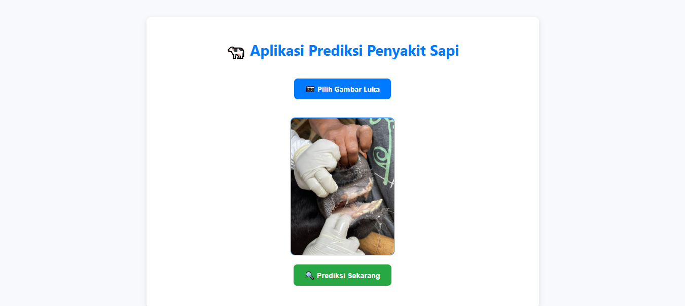
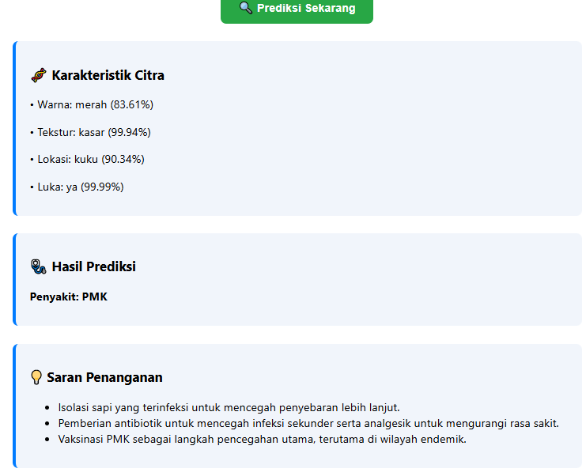

# 🐄 Cattle Disease Detection & Prediction System

A web-based machine learning application for detecting **Foot-and-Mouth Disease (FMD)** and other cattle diseases from wound images — built as a real-world solution to assist early disease identification for farmers and veterinarians.

> 🏆 Final thesis project | Universitas Komputer Indonesia | 2025  
> ✅ Achieved **95% classification accuracy** | Trained on **500+ images** | Deployed to production via Render

---

## 🎯 Problem Statement

Foot-and-mouth disease (PMK) is one of the most devastating livestock diseases in Indonesia, causing massive economic losses for farmers. Early detection is critical — but access to veterinary diagnosis is limited, especially in rural areas.

This system provides an accessible, image-based diagnostic tool that can be used directly from a web browser.

---

## 🧠 How It Works

The system uses a **two-stage pipeline**:

1. **Feature Extraction (Azure Custom Vision)**
   - Analyzes wound images for color, texture, wound location, and presence of wound
   - Trained on 500+ labeled cattle images

2. **Disease Classification (SVM)**
   - Support Vector Machine classifier with StandardScaler normalization
   - Rule-based post-processing for logical consistency
   - Classifies into 4 categories:
     - PMK / Foot-and-Mouth Disease
     - Foot Rot
     - Necrotic Stomatitis
     - Healthy

---

## 📊 Results

| Metric | Score |
|--------|-------|
| Classification Accuracy | **95%** |
| Computer Vision Model Accuracy | **90% (avg)** |
| Training Images | **500+** |
| Deployment | **Flask + Render (Production)** |

---

## 🖥️ Interface




---

## 🏗️ Project Structure

```
.
├── app/
│   ├── config.py          # Configuration & constants
│   ├── ml_service.py      # ML logic & prediction pipeline
│   └── routes.py          # Flask routes
├── models/
│   ├── SVM_linear.pkl
│   └── scaler.pkl
├── static/
│   └── style.css
├── templates/
│   └── index.html
├── app.py                 # Flask entry point
└── README.md
```
---

## ⚙️ Tech Stack

`Python` • `Scikit-learn` • `Azure Custom Vision` • `Flask` • `Pandas` • `NumPy` • `Render`

---

## 🚀 How to Run Locally

```bash
# Clone the repo
git clone https://github.com/WildanAz/detection-fmd-cattle.git
cd detection-fmd-cattle

# Install dependencies
pip install -r requirements.txt

# Run the app
python app.py
```

> **Note:** Azure Custom Vision API key required for feature extraction. Set your credentials in `app/config.py`.

---

## 💡 Key Learnings

- End-to-end ML pipeline from data collection to production deployment
- Integrating cloud-based computer vision (Azure) with custom ML classifiers
- Handling real-world constraints: limited labeled data, class imbalance, deployment on free-tier hosting
